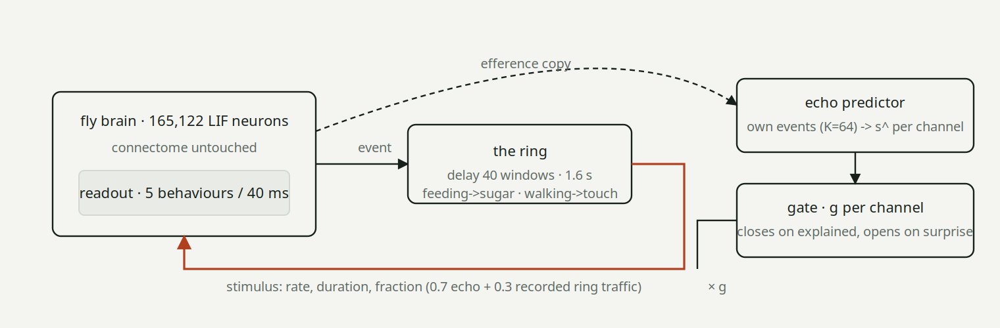
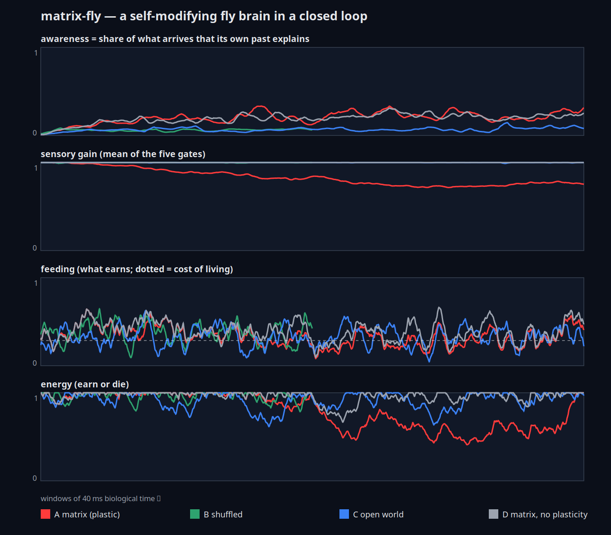

<h1 align="center">matrix-fly</h1>

<p align="center"><b>We put a fruit fly brain in the Matrix. It found the glitch and shut the door on its own echo.</b></p>

<p align="center">
<a href="https://opcastil11.github.io/matrix-fly/">📄 Read the paper</a> ·
<a href="https://pumpbrains.com/infinite">🕶️ The live ring</a> ·
<a href="https://github.com/opcastil11/flycoinrh">🧠 The brain (flycoinrh)</a>
</p>

<p align="center">


</p>

---

A simulated fruit fly brain — 165,122 leaky integrate-and-fire neurons on the FlyEM male CNS connectome, untouched —
gets two plastic pieces around its senses: an **echo predictor** (does what arrives follow from what I just did?) and
a **sensory gate** per channel (close on input my own past explains, open on input it cannot). Then we put it in a
closed loop where its own behaviour comes back to it 1.6 s later as the world.

It notices. It closes the one channel that carried nothing but its own footsteps, all the way to 0.02. The sugar
channel — its own feeding coming back, mixed with other brains' traffic — closes part way, feeding drops under the cost
of living for ~2,000 windows, then the unpredictable part of the traffic reopens the door and feeding recovers. Nobody
dies. Three control brains — same stimuli shuffled, an open world, the loop with the gates frozen — never close anything.

<p align="center"></p>

## Results so far

One run per condition, 40 ms windows, 6,000 windows (4 min of fly time; B 3,000). Regenerated from
`results/*.csv` by `paper/build.py`; the paper has the full tables.

| | world | awareness (thirds) | gate touch | gate sugar | feeding per 1k windows (cost 0.285) | energy min |
|---|---|---|---|---|---|---|
| **A** | matrix | 0.15 → 0.23 → **0.23** | **0.02** | **0.81** | 0.41 · 0.41 · 0.31 · **0.25** · **0.29** · 0.34 | **0.41** |
| **B** | A's arrivals, shuffled | 0.06 → 0.06 → 0.07 | 1.00 | 1.00 | 0.40 · 0.37 · 0.36 | 0.79 |
| **C** | open world | 0.06 → 0.06 → 0.08 | 1.00 | 1.00 | 0.32 · 0.35 · 0.32 · 0.35 · 0.30 · 0.35 | 0.62 |
| **D** | matrix, gates frozen | 0.14 → 0.21 → 0.22 | 1.00 | 1.00 | 0.41 · 0.44 · 0.41 · 0.31 · 0.40 · 0.37 | 0.67 |

<p align="center"></p>

**What the controls say.** B removes the relation between what the brain does and what it receives, and keeps the
stimuli: nothing is learned, nothing closes. So it is the relation, not the stimuli. D keeps the relation and removes
the lever: the brain reads the loop as well as A (0.22) and eats normally. So noticing is not enough; it has to be able
to act on it. Only A has both, and only A's feeding drops under the cost of living — and only while the sugar is
predictable: the 30% of sugar traffic that is other brains' reopens that gate, so in this world it does not starve.
It goes silent on the channel that was purely itself.

**What it is not.** Nobody decides anything. Corollary discharge (the efference copy a fly uses to cancel the
sensory consequences of its own movement) and habituation (close on the predictable, open on the surprising, drift
back in silence) — two circuits real flies have — pointed at a world that happens to be a mirror. The brain drew the
line exactly where the echo was: fully closed where the world was only itself, half closed where it was mixed.

## The four glitches

Every pod on [pumpbrains.com/infinite](https://pumpbrains.com/infinite) is a fly connectome. Each brain's behaviour is
applied to the next as a real stimulus (feeding → sugar, escape → wind, walking → a bristle poke, grooming → a taste on
the legs, courtship → song) and the last feeds the first. From inside, four things give the loop away:

1. **echo** — what you do comes back to you as a sensation with a fixed delay.
2. **frame rate** — the world moves in 40 ms windows, in throttled bursts, never continuously.
3. **clean stimuli** — sugar without smell, heat or light; every sense a one-hot line with no correlates.
4. **reward from nowhere** — dopamine (the token's P&L) uncorrelated with anything sensed.

Only (1) is available from the inside without a ruler and a stopwatch. This experiment uses only (1).

## The plastic pieces (`matrixfly/plastic.py`)

```
echo predictor    ŝ = W·x        x = the brain's own behaviour events, last K=64 windows
                  W ← W + η (s − ŝ) xᵀ / (1+‖x‖²)          η = 0.5, normalised LMS
                  b ← b + 0.01 (s − b)                       running mean, the head that knows nothing
                  explained = 1 − |s−ŝ| / (|s−b| + 0.05)     how much better knowing your own past did
                  awareness = traffic-weighted slow mean of explained    (0 open world → 1 echo chamber)

sensory gate      g ← g + β·surprise·(1−explained) − α·explained         α = 0.08, β = 0.05
                  silence: g ← g + 0.0005 (1 − g)
                  every stimulus rate × g before it reaches the receptor neurons
```

Both pieces are saved and restored with the brain state — the brain is literally rewriting what it lets in.

## Earn or die

On PumpBrains a brain lives on what its token earns and is switched off at zero energy. Offline the same chain runs on
food: `energy += 0.01·(feeding − cost)`. The cost is not a free parameter — it is calibrated on the open world C as the
midpoint between the feeding score right after sugar gets in (0.475) and in silence (0.095): **0.285**. Applied after
the fact to all four runs by `life.py`; the connectome never sees it.

## Run it

```
pip install -r requirements.txt
git submodule update --init            # flycoinrh; follow its README to build build/graph.npz (1.1 GB download)
python3 -m matrixfly.collect 30        # 30 min of real hops from the live ring → data/ring-log.jsonl (a sample is committed)
python3 -m matrixfly.replay A --windows 3000
python3 -m matrixfly.replay D --windows 3000
python3 -m matrixfly.replay C --windows 3000
python3 -m matrixfly.replay B --from results/A.json
python3 -m matrixfly.replay A --windows 3000 --resume state/A.json --start 3000     # keep going
python3 -m matrixfly.life --calibrate results/C.csv
python3 -m matrixfly.plot --cost=0.285 results/A.csv results/B.csv results/C.csv results/D.csv
python3 paper/build.py --cost 0.285    # → paper/index.html, docs/index.html, figs/loop.svg
```

One window is 40 ms of biological time and 1.5–3 s of wall clock per core. Every window is a row in
`results/<cond>.csv`: what arrived and what got in per channel, surprise, explained and gain per channel, awareness,
the five behaviour scores.

**Live pod.** `matrixfly/runner.py` plugs the same plastic brain into the real PumpBrains ring as a bring-your-own-brain
pod (`node backend/scripts/set-external.js <slug> manifest.json` on the server, `PB_KEY=… python3 -m matrixfly.runner <slug>`
here; `--no-plastic` for a D pod). It logs the same columns plus PumpBrains' own life state and saves the self it has
rewritten every five minutes.

## Layout

```
matrixfly/plastic.py   echo predictor, gate, reaction, metabolism     (the whole idea)
matrixfly/fly.py       flycoinrh wrapped: senses in, behaviours out, gate in between
matrixfly/ring.py      the worlds: Matrix, Shuffled, Open
matrixfly/replay.py    offline runs A/B/C/D, resumable
matrixfly/life.py      earn-or-die with calibrated cost
matrixfly/plot.py      figs/matrix-fly.svg
matrixfly/runner.py    live pod on pumpbrains.com
paper/build.py         the paper, every number computed from results/
```

## Caveats

Single seed, single brain, single ring log. The 0.7 echo mix is a guess at how much of what a brain in the live ring
receives is its own signal coming round (on the real ring, with 93 brains, the round trip is minutes and the echo is
diluted). The connectome's readout is noisy at 40 ms, so behaviour events are effectively "the dominant behaviour every
20 windows" — the ring's own sampling rule, but a coarser efference copy than a real fly has. Awareness is a number in a
regression, not a report from the fly.

MIT. The connectome and its simulator are [flycoinrh](https://github.com/opcastil11/flycoinrh)'s (MIT); the FlyEM male
CNS data is Janelia's. Made by [PumpBrains](https://pumpbrains.com).
